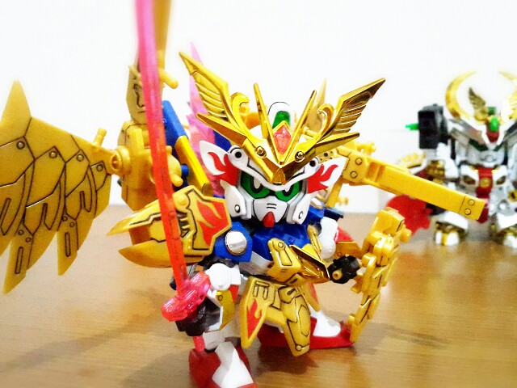

# **Carousel**

--------------------------------------------------------------------------------------------------------------------------------------------------------------------------------

[](http://forthebadge.com)
[](http://forthebadge.com)
[](http://forthebadge.com)
[](http://forthebadge.com)
[](http://forthebadge.com)
[](http://forthebadge.com)

## **Objetivo**

El objetivo de este trabajo es crear un carrusel de imágenes que pueda ser reutilizado por otros usuarios(con o sin conocimiento de progaramación) como una herramienta para cumplir con los diversos fines que ellos le puedan asignar, ya sea para una exposición, fines recreativos o cualquier otro fin.


## **Herramientas Tecnológicas Empleadas**

* HTML5

* CSS3

* Javascript

* jQuery(librería de Javascript)

* Guía de Estilos

## **Flujo de la Aplicación**

* El usuario puede ver las imágenes apretando los botones circulares.


* También puede hacer click a la flecha izquierda o a la derecha para ver la imagen anterior o posterior respectivamente.


## **Guía de uso**

Esta guía busca explicarte de manera simple como puedes reutilizar Carousel. Si sientes que estás perdido o no ubicas algo ```no te preocupes```, hay comentarios dentro de los archivos de este trabajo que te guiarán. Ahora si empecemos:

```bash
**Estructura de Carpetas**

Proyecto
│
├── assets/
│   ├── images/
│       └── // Imágenes
│
├── css/
│   ├── main.css
│
├── js/
│   ├── app.js
│
│
├── index.html
│
├──vendors/
│  ├── jquery
│      └── jquery-3.2.1.min.js
│
├── .eslintrc
│
└── README.md

```

Primero, para cambiar las imágenes por defecto, ve a la carpeta ```images```(ver estructura de carpetas) y reemplaza las imágenes que veas en el carrusel por las que quieras.


Después, ve al archivo ```index.html```. Allí, busca la sección de imágenes:

```bash
<!-- Sección de imágenes -->
<section>
  <div data-slide="0" class="carousel-content active">
    
  </div>
  ...
</section>
```

Ahora simplemente reemplaza el valor de ```src``` con la ruta de tu imagen:

```bash
   src="assets/images/nombredetuimage.jpg"
```

En cuanto a las imágenes pueden ser en cualquier formato(png o cualquier otro), pero de ejemplo he utilizado el jpg(```.jpg```).

En este archivo hay 9 atributos ```src``` dentro de etiquetas  ```img```. Así que si quieres reemplazar todas las imágenes, tendrás que reemplazar todos los ```src```.

```bash
   
```

Sobre el atributo ```alt``` de cada imagen, puedes reemplazarlo con una breve descripción de tu imagen(un par de palabras). No obstante, no aparecerá en la pantalla. 

Si no entiendes de lo que hablo, revisa estos link:

* [¿Qué son atributos?](https://developer.mozilla.org/es/docs/Web/HTML/Atributos)

* [La etiqueta img y sus atributos](https://www.hazunaweb.com/curso-de-html/imagenes/)

Aparte de eso, puedes añadir más imágenes. Para ello, en el archivo ```index.html``` ve hasta la última imagen:

```bash
<div data-slide="8" class="carousel-content">
  
</div>
```

Debajo de ella copia una estructura similar, solo reemplaza el valor del atributo data llamado slide(```data-slide```) por el número que sigue:

```bash
<div data-slide="9" class="carousel-content">
  
</div>
```

En este caso como el ```data-slide``` de la última imagen era 8, para la nueva iamgen este atributo debe tener como valor el número 9. Ahora, ve a la sección de botones:

```bash
<!-- Sección de botones -->
<section>
  ...
  <button data-target="8" class="control" type="button"></button>
  <a href="#" class="next">&#10095;</a>
</section>
```

Debajo del elemento ```button``` cuyo atributo data llamado target(```data-target```) tiene como valor 8, escribe un elemento igual solo cambia el valor de este ```data-target``` con el número que sigue:

```bash
<!-- Sección de botones -->
<section>
  ...
  <button data-target="8" class="control" type="button"></button>
  <button data-target="9" class="control" type="button"></button> <---- Nuevo botón
  <a href="#" class="next">&#10095;</a>
</section>
```

Esto es para que aparezca un botón circular para tu nueva imagen:


Hasta ahora, si lo ves en la pantalla aperecerá un nuevo botón y podrás ver tu imagen. Pero si das click a alguna de las flechas, no saldrá. Esto es porque tienes que ampliar su funcionalidad. No me entiendes, no te preocupes solo sigue los siguientes pasos:

* Ve al archivo ```app.js``` (ver estructura de carpetas).

* Dirígete al evento para el ícono flecha hacia la izquierda:

```bash
// Evento para mostrar la imagen previa(Ícono de flecha hacia la izquierda)
  $previous.click(function(event) {
  ...
  target = (target < 0) ? 8 : target;
  ...
  });
```

* Allí, cambia el número 8 por el valor del atributo ```data-target```del último botón:

```bash
// Evento para mostrar la imagen previa(Ícono de flecha hacia la izquierda)
    target = (target < 0) ? 9 : target;
```


* Por último, haz lo mismo con el ícono flecha hacia la derecha.
